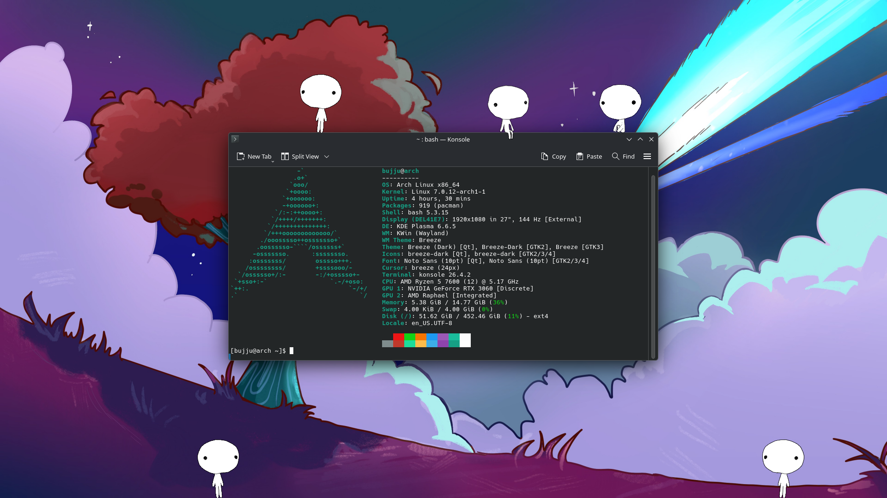

<h1 align="center">ShimeLinux</h1>

<p align="center">An unofficial Linux port of Shimeji-ee desktop pet. Any Shimeji made for the latest version of Shimeji-ee should work. See the supported Linux distributions, desktop environments, and tiling window managers <a href="https://github.com/BujjuIsABee/shimelinux#compatibility">here</a>.</p>

<p align="center">
    <a href="https://github.com/BujjuIsABee/shimelinux/releases"></a>
    <a href="https://github.com/BujjuIsABee/shimelinux/issues"></a>
    <a href="https://github.com/BujjuIsABee/shimelinux/blob/master/LICENSE"></a>
</p>



## Installation

### Debian-based distributions

If you are on **Debian** or a Debian-based distribution, you can download the `.deb` file [here](https://github.com/BujjuIsABee/shimelinux/releases).

### RPM-based distributions

If you are on an RPM-based distribution, such as **Fedora**, you can download the `.rpm` file [here](https://github.com/BujjuIsABee/shimelinux/releases).

### Arch-based distributions

If you are on **Arch** or an Arch-based distribution, you can install ShimeLinux from the Arch User Repository.

`git clone https://aur.archlinux.org/shimelinux.git`

`cd shimelinux`

`makepkg -si`

You can also use an AUR helper.

`paru -S shimelinux` or `yay -S shimelinux`

### Nix and NixOS

If you are on **NixOS** or are using the Nix package manager, you can install ShimeLinux from the Nix User Repository.

First, set up the NUR by following its [documentation](https://nur.nix-community.org/documentation/).

You can then install it with the Home Manager module:

```nix
{
  imports = [
    inputs.nur.repos.claymorwan.homeModules.shimelinux
  ];

  shimelinux = {
    enable = true;
    # If you want shimelinux to launch on boot (off by default)
    autostart = true;
  };
}
```

Alternatively, you can also add ShimeLinux to your packages:

```nix
{
  # System-wide install
  environment.systemPackages = with pkgs; [
    nur.repos.claymorwan.shimelinux
  ];

  # User-side / Home Manager install
  home.packages = with pkgs; [
    nur.repos.claymorwan.shimelinux
  ];
}
```

### Other distributions

If none of these options work for you, you can download the `.jar` file [here](https://github.com/BujjuIsABee/shimelinux/releases). You will also need to install the following dependencies:

- Java Runtime Environment (version 21 or later)
- libappindicator or libayatana-appindicator

## How to use

When you open ShimeLinux, a Shimeji will appear. You can right-click on a Shimeji to open a menu with options for that Shimeji, or right-click on the system tray icon for general options. To close the program, open one of these menus and select "Dismiss All."

To add more Shimeji, click on the system tray icon and select "Choose Shimeji...." Then, click on the "More..." button to open the `img` folder. Once you've added Shimeji to this folder, you can reopen the Shimeji chooser and select the Shimeji you want to use.

> [!WARNING]
> Make sure not to select too many Shimeji at once, as ShimeLinux can use a lot of your computer's memory. You can disable Shimeji in the Shimeji chooser or move some that are not in use to the `img/unused` folder.

## Compatibility

ShimeLinux has been tested on the following Linux distributions and desktop environments:

| Distribution | DE / Compositor | How to setup                                                       |
|--------------|-----------------|--------------------------------------------------------------------|
| Arch Linux   | GNOME           | Works out of the box                                               |
| Arch Linux   | Hyprland        | See [Hyprland](https://github.com/BujjuIsABee/shimelinux#hyprland) |
| Arch Linux   | KDE Plasma      | Works out of the box                                               |
| Arch Linux   | niri            | See [niri](https://github.com/BujjuIsABee/shimelinux#niri)         |
| Arch Linux   | sway            | See [sway](https://github.com/BujjuIsABee/shimelinux#sway)         |
| Fedora       | KDE Plasma      | Works out of the box                                               |
| Linux Mint   | Cinnamon        | Works out of the box                                               |
| NixOS        | KDE Plasma      | Works out of the box                                               |
| NixOS        | niri            | See [niri](https://github.com/BujjuIsABee/shimelinux#niri)         |
| Pop!_OS      | COSMIC          | Works out of the box                                               |
| Ubuntu       | GNOME           | Works out of the box                                               |

### Tiling Window Managers

ShimeLinux supports some tiling Wayland compositors, but they require additional steps to set up. Follow the steps listed below for your compositor.

> [!NOTE]
> If Shimeji are still not displaying properly, or you are using a compositor that is not supported, you will need to manually enable the Wayland environment:
>
> - Right-click on the system tray icon and select "Settings"
> - Select the "Window Mode" tab and click on the "Environment Settings" button
> - Choose "Wayland" (if it's not there, make sure `XDG_SESSION_TYPE` is set to `wayland`)
>
> You may encounter some issues when using the Wayland environment on an unsupported compositor. The only compositors/DEs that are supported are Hyprland, niri, sway, KDE Plasma, and COSMIC.

#### Hyprland

Add this to your Hyprland configuration file (`~/.config/hypr/hyprland.lua`):

```lua
hl.env("_JAVA_AWT_WM_NONREPARENTING", "1")
```

#### Niri

Add this to your niri configuration file (`~/.config/niri/config.kdl`):

```kdl
environment {
    _JAVA_AWT_WM_NONREPARENTING "1"
}

window-rule {
    match app-id="com-group_finity-mascot"
    open-floating true
}
```

#### Sway

Add this to your sway configuration file (`~/.config/sway/config`):

```
for_window [class="com-group_finity-mascot"] floating enable
```

Ensure that the `_JAVA_AWT_WM_NONREPARENTING` environment variable is set to `1` before launching the program.

### GPU compatibility / Graphical issues

ShimeLinux should work on most AMD and NVIDIA graphics cards.

On Intel integrated graphics and some older GPUs, you may experience some visual issues. If you are using a Wayland compositor that supports the `wlr_layer_shell` protocol (i.e., KDE Plasma), you can try using the Wayland environment by going to the "Window Mode" tab in the settings menu, selecting "Environment Settings," and choosing "Wayland."

## Licenses

This project incorporates work from [Shimeji-ee by Kilkakon](https://kilkakon.com/shimeji), [SystemTray by dorkbox](https://github.com/dorkbox/SystemTray), [FlatLaf by FormDev](https://github.com/JFormDesigner/FlatLaf), [hqx-java by Arcnor](https://github.com/Arcnor/hqx-java), [dbus-java by hypfvieh](https://github.com/hypfvieh/dbus-java), and [Smithay's Client Toolkit](https://github.com/smithay/client-toolkit). You can view the licenses for these projects [here](https://github.com/BujjuIsABee/shimelinux/blob/master/LICENSE-ORIGINAL).
