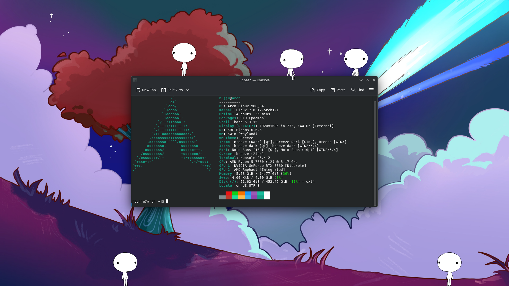

<div align="center">


# ShimeLinux

An unofficial port of Shimeji-ee desktop pet for Linux and BSD. Any Shimeji made for the latest version of Shimeji-ee should work. See the supported operating systems, desktop environments, and tiling window managers [here](https://github.com/BujjuIsABee/shimelinux#compatibility).

[](https://github.com/BujjuIsABee/shimelinux/releases)
[](https://github.com/BujjuIsABee/shimelinux/issues)
[](https://github.com/BujjuIsABee/shimelinux/blob/master/LICENSE)



</div>

## Installation

### Debian-based distributions

If you are on **Debian** or a Debian-based distribution, you can download the `.deb` file [here](https://github.com/BujjuIsABee/shimelinux/releases).

### RPM-based distributions

If you are on an RPM-based distribution, such as **Fedora**, you can download the `.rpm` file [here](https://github.com/BujjuIsABee/shimelinux/releases).

### Arch-based distributions

If you are on **Arch** or an Arch-based distribution, you can install ShimeLinux from the Arch User Repository.

`git clone https://aur.archlinux.org/shimelinux.git`

`cd shimelinux`

`makepkg -si`

You can also use an AUR helper.

`paru -S shimelinux` or `yay -S shimelinux`

### Nix and NixOS

If you are on **NixOS** or are using the Nix package manager, you can install ShimeLinux from the Nix User Repository.

First, set up the NUR by following its [documentation](https://nur.nix-community.org/documentation/).

You can then install it with the Home Manager module:

```nix
{
  imports = [
    inputs.nur.repos.claymorwan.homeModules.shimelinux
  ];

  shimelinux = {
    enable = true;
    # If you want ShimeLinux to launch on boot (off by default)
    autostart = true;
  };
}
```

Alternatively, you can also add ShimeLinux to your packages:

```nix
{
  # System-wide install
  environment.systemPackages = with pkgs; [
    nur.repos.claymorwan.shimelinux
  ];

  # User-side / Home Manager install
  home.packages = with pkgs; [
    nur.repos.claymorwan.shimelinux
  ];
}
```

### Other

If none of these options work for you, you can download the `.jar` file [here](https://github.com/BujjuIsABee/shimelinux/releases) and run it with Java. You will also need to install `libappindicator` or `libayatana-appindicator` for the system tray icon to work.

## Usage

When you open ShimeLinux, a Shimeji will appear. You can right-click on a Shimeji to open a menu with options for that Shimeji, or right-click on the system tray icon for general options. To close the program, open one of these menus and select "Dismiss All."

To add more Shimeji, click on the system tray icon and select "Choose Shimeji...." Then, click on the "More..." button to open the `img` folder. Once you've added Shimeji to this folder, you can reopen the Shimeji chooser and select the Shimeji you want to use.

## Compatibility

ShimeLinux has been tested on the following operating systems and desktop environments:

| Operating system | Desktop environment(s)                                                                                                                                                                                            | Install                                                                        |
|------------------|-------------------------------------------------------------------------------------------------------------------------------------------------------------------------------------------------------------------|--------------------------------------------------------------------------------|
| Arch Linux       | • Awesome 4.3 <br/> • Cinnamon 6.6 <br/> • dwm 6.8 <br/> • GNOME 50 <br/> • Hyprland v0.5 <br/> • i3 4.25 <br/> • KDE Plasma 6.6 <br/> • KDE Plasma 6.7 <br/> • niri v26.04 <br/> • sway 1.12 <br/> • XMonad 0.18 | [![AUR]](https://github.com/BujjuIsABee/shimelinux#arch-based-distributions)   |
| Debian 13        | • LXQt 2.4 <br/> • MATE 1.26                                                                                                                                                                                      | [![DEB]](https://github.com/BujjuIsABee/shimelinux#debian-based-distributions) |                                                                             |
| Fedora Linux 44  | • KDE Plasma 6.7                                                                                                                                                                                                  | [![RPM]](https://github.com/BujjuIsABee/shimelinux#rpm-based-distributions)    |
| FreeBSD 15       | • KDE Plasma 6.7 <br/> • Xfce 4.20                                                                                                                                                                                | [![JAR]](https://github.com/BujjuIsABee/shimelinux#other)                      |
| Linux Mint 22    | • Cinnamon                                                                                                                                                                                                        | [![DEB]](https://github.com/BujjuIsABee/shimelinux#debian-based-distributions) |
| NixOS 26.05      | • KDE Plasma 6.7 <br/> • niri v26.04                                                                                                                                                                              | [![NUR]](https://github.com/BujjuIsABee/shimelinux#nix-and-nixos)              |
| Pop!_OS 24.04    | • COSMIC 1.8                                                                                                                                                                                                      | [![DEB]](https://github.com/BujjuIsABee/shimelinux#debian-based-distributions) |
| Ubuntu 26.04     | • GNOME 50                                                                                                                                                                                                        | [![DEB]](https://github.com/BujjuIsABee/shimelinux#debian-based-distributions) |
| Void Linux       | • Xfce 4.20                                                                                                                                                                                                       | [![JAR]](https://github.com/BujjuIsABee/shimelinux#other)                      |

[AUR]: https://img.shields.io/badge/AUR-rgba(0,0,0,0)?style=flat-square&logo=archlinux
[DEB]: https://img.shields.io/badge/.deb-rgba(0,0,0,0)?style=flat-square&logo=debian&logoColor=red
[RPM]: https://img.shields.io/badge/.rpm-rgba(0,0,0,0)?style=flat-square&logo=redhat&logoColor=red
[JAR]: https://custom-icon-badges.demolab.com/badge/.jar-rgba(0,0,0,0)?style=flat-square&logo=java&logoColor=orange
[NUR]: https://img.shields.io/badge/NUR-rgba(0,0,0,0)?style=flat-square&logo=nixos

### Graphical issues on Wayland

When running ShimeLinux on Wayland, Shimeji may be displayed through XWayland instead of native Wayland surfaces. If you notice graphical issues, such as a black background appearing behind Shimeji, try enabling the Wayland environment by right-clicking on the system tray icon, selecting "Settings," going to the "Environment" tab, and choosing "Wayland."

> [!NOTE]
> This will not work on GNOME, Cinnamon's Wayland session, or any other desktop environment/compositor that does not implement the `wlr_layer_shell` protocol.

## Licenses

This project incorporates work from [Shimeji-ee by Kilkakon](https://kilkakon.com/shimeji), [SystemTray by dorkbox](https://github.com/dorkbox/SystemTray), [FlatLaf by FormDev](https://github.com/JFormDesigner/FlatLaf), [hqx-java by Arcnor](https://github.com/Arcnor/hqx-java), [dbus-java by hypfvieh](https://github.com/hypfvieh/dbus-java), and [Smithay's Client Toolkit](https://github.com/smithay/client-toolkit). You can view the licenses for these projects [here](https://github.com/BujjuIsABee/shimelinux/blob/master/LICENSE-ORIGINAL).
